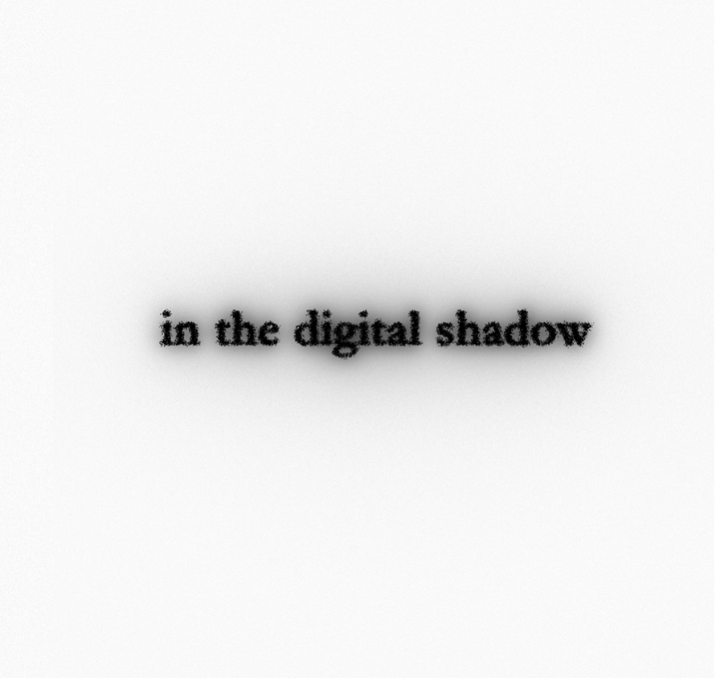

# in the digital shadow: An Embodied Debrief

Public research repository for Slava Romanov's master's thesis and artistic research project **in the digital shadow: An Embodied Debrief**. It brings together the thesis PDF, the methodological frame, selected public data, key analytical diagrams, and the minimum technical context needed to understand how the research was built.

## Read

- [Key Findings](docs/key-findings.md)
- [Methodology](docs/methodology.md)
- [Data Policy](docs/data-policy.md)
- [Thesis PDF](romanov_in_the_digital_shadow.pdf)

## Structure

The thesis rereads the production process through four operational modes:

- **Collect**: accumulation of traces, references, logs, notes, source material, and leftovers.
- **Allocate**: distribution of time, money, attention, space, and technical capacity.
- **Delegate**: work externalized to collaborators, software, AI systems, hardware, interfaces, and infrastructure.
- **Overload**: moments when density, coordination, expectation, and embodied capacity exceed a workable limit.

These modes organize both the installation logic and the research corpus.

## Reuse

- [Reproduce](docs/reproduce.md)
- [Templates](data/templates)

## Core Material

- [Key figures](data/derived/figures)
- [Project mass data](data/derived/project_mass)
- [Allocation data](data/derived/allocate)
- [Delegation data](data/derived/delegate)
- [Overload data](data/derived/overload)
- [TouchDesigner system snapshots](data/curated/system)

## Related Project Links

- Project page: [slavaromanov.art/2026/in-the-digital-shadow](https://www.slavaromanov.art/2026/in-the-digital-shadow)
- Thesis PDF in this repository: [romanov_in_the_digital_shadow.pdf](romanov_in_the_digital_shadow.pdf)

The project page provides the artistic and installation-facing overview. This repository provides the documentary, methodological, and data-facing layer.

## Privacy And Scope

Public material in this repository is curated, reduced, and in some cases depersonalized or derived.

- third-party messages were filtered locally before any public layer was prepared;
- privacy-sensitive corpora and raw health exports are not published here as-is;
- only selected author-controlled or privacy-safe outputs should enter `data/curated/` or `data/derived/`.

See [data-policy.md](docs/data-policy.md) for details.

## AI-Assisted Workflow

Parts of the repository documentation, scripting, editorial restructuring, and selected analysis support were developed with assistance from GPT Codex and other local or hosted language models. Curation, interpretation, selection, redaction, and final responsibility remain with the author.

