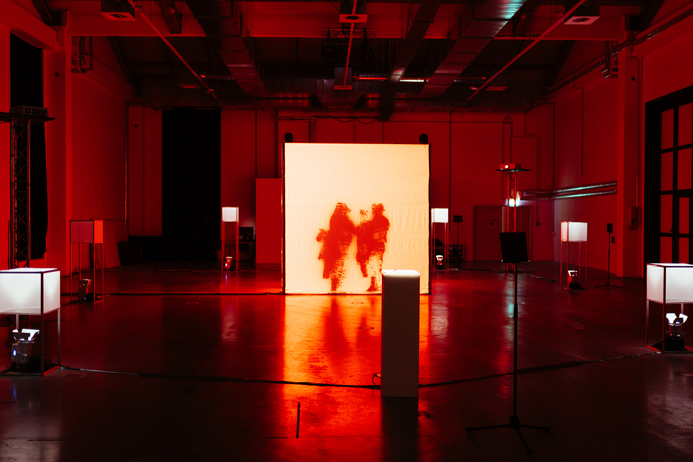

# HfK Documentation Build

Local Markdown-to-PDF build for `docs/hfk-bremen/extended-documentation.md`.

## Build

From the repository root:

```powershell
.\docs\hfk-bremen\build\build-documentation.ps1
```

Or render another Markdown file:

```powershell
.\docs\hfk-bremen\build\build-documentation.ps1 .\docs\hfk-bremen\extended-documentation.md
```

Outputs:

- `docs/hfk-bremen/output/extended-documentation.html`
- `docs/hfk-bremen/output/extended-documentation.pdf`

## Markdown Images

Use normal Markdown image syntax:

```md

```

Relative paths are resolved from the Markdown file location and embedded into the generated HTML/PDF.

## Page Breaks

Insert a manual page break with:

```md
{{PAGEBREAK}}
```

## Cover

The first page uses front matter where available:

```yaml
title: "in the digital shadow: An Embodied Debrief"
subtitle: "Final Documentation"
author: "Viacheslav (Slava) Romanov"
program: "Digital Media Bremen / HfK Bremen"
year: "2026"
supervisors: "Dennis P. Paul; Ralf Baecker"
coverImage: "../assets/photos/selected/1_ids_jimi_liu.jpg"
coverCredit: "Photo: Jimi Liu"
coverPosition: "center center"
```

If `coverImage` is omitted, the build uses `../assets/photos/selected/1_ids_jimi_liu.jpg`.
