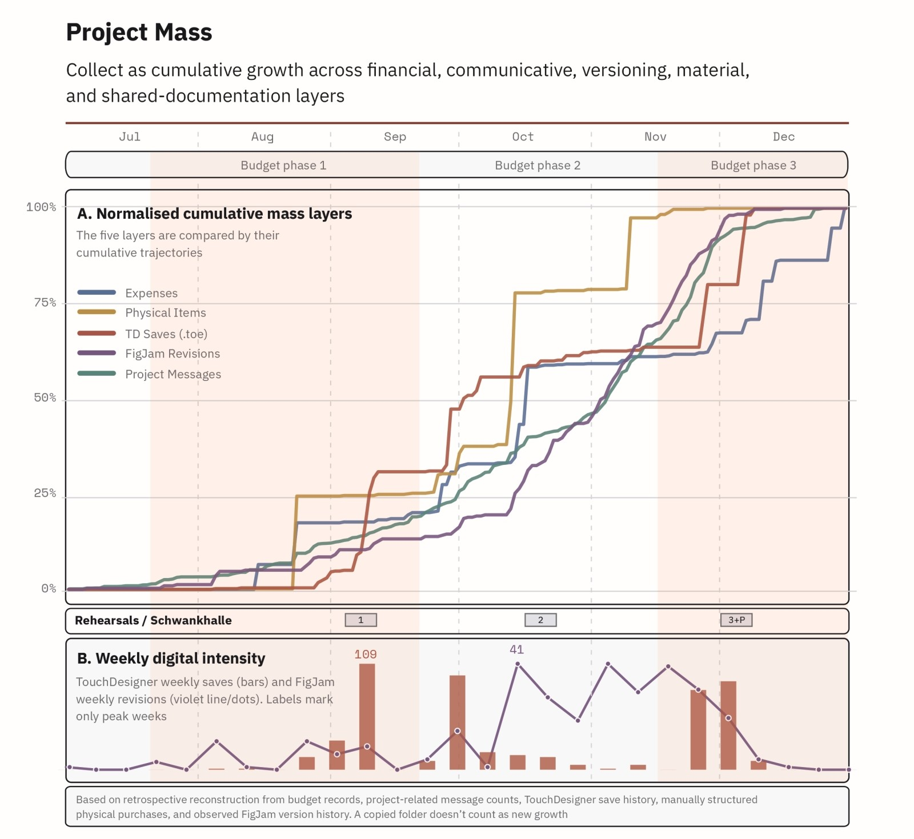
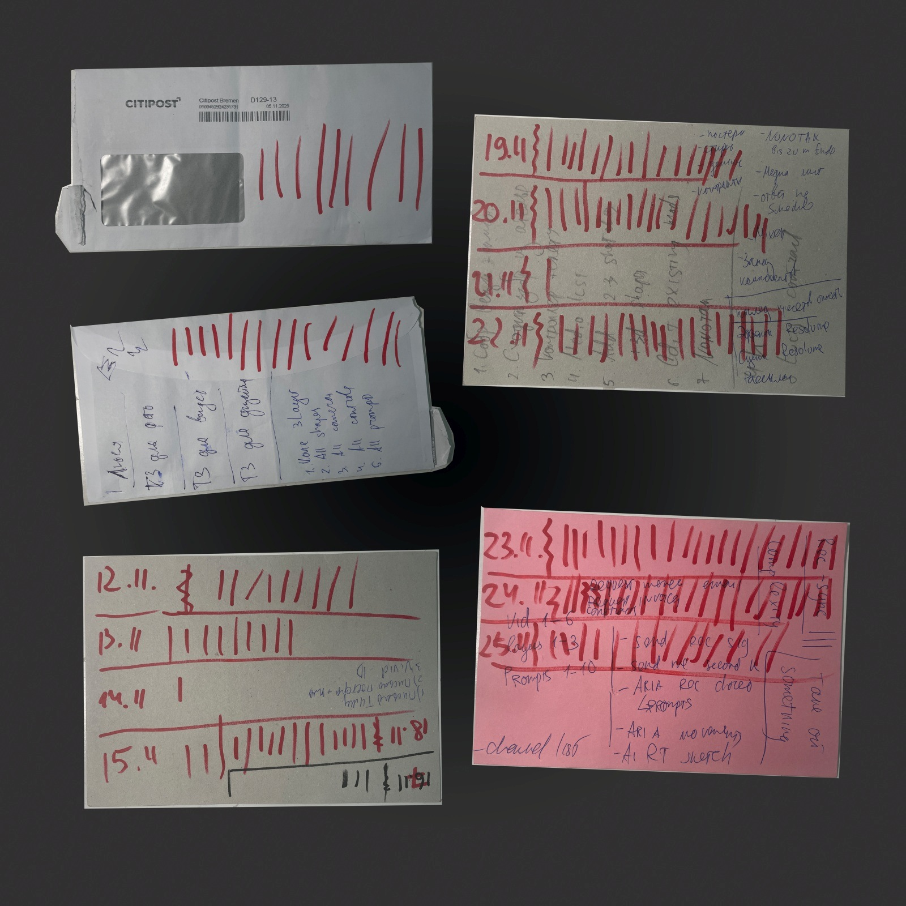
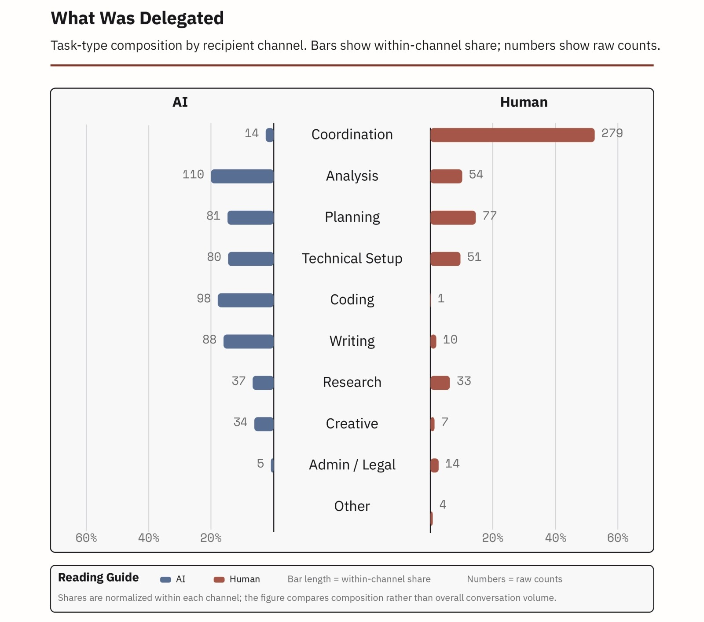
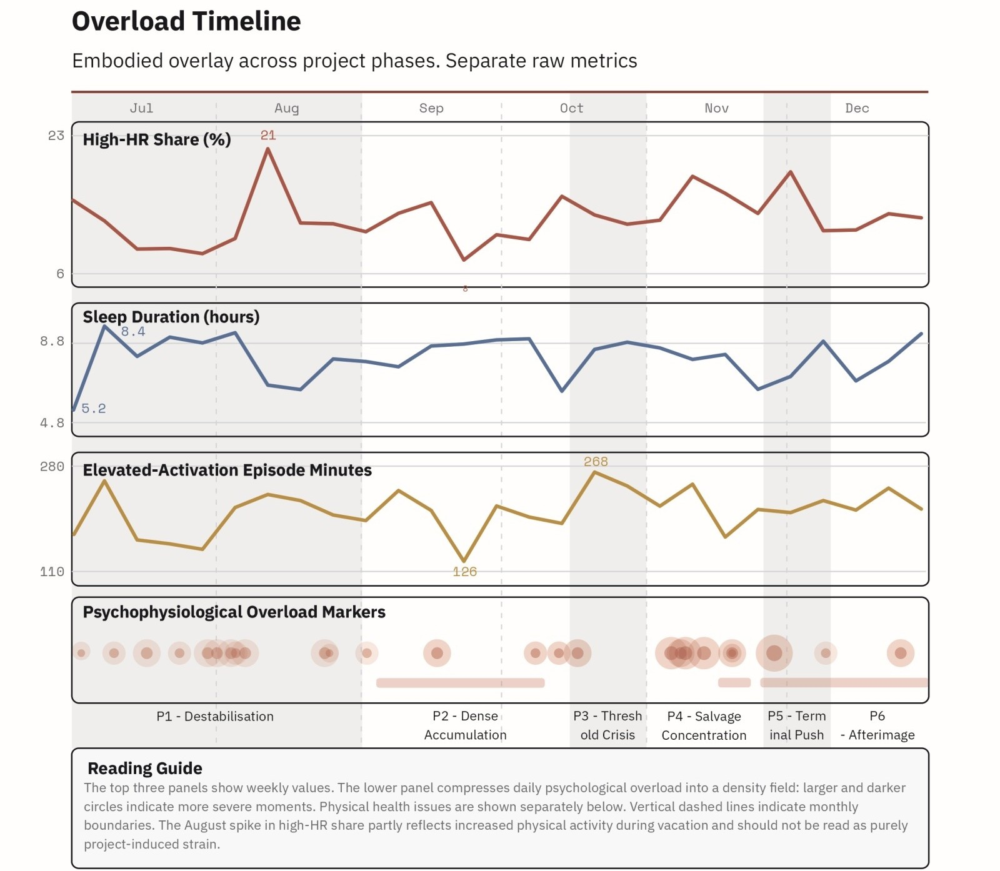
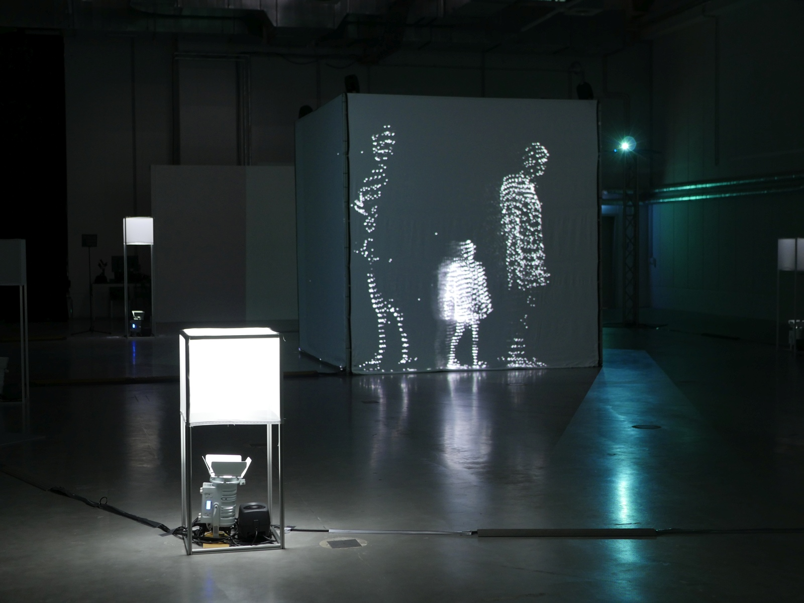
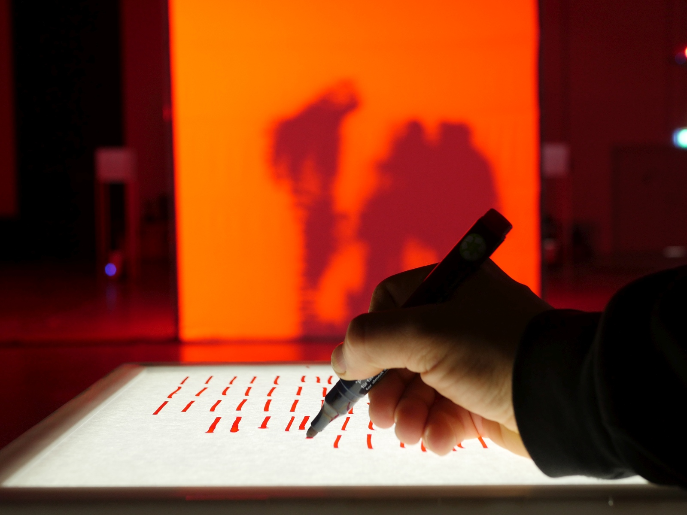
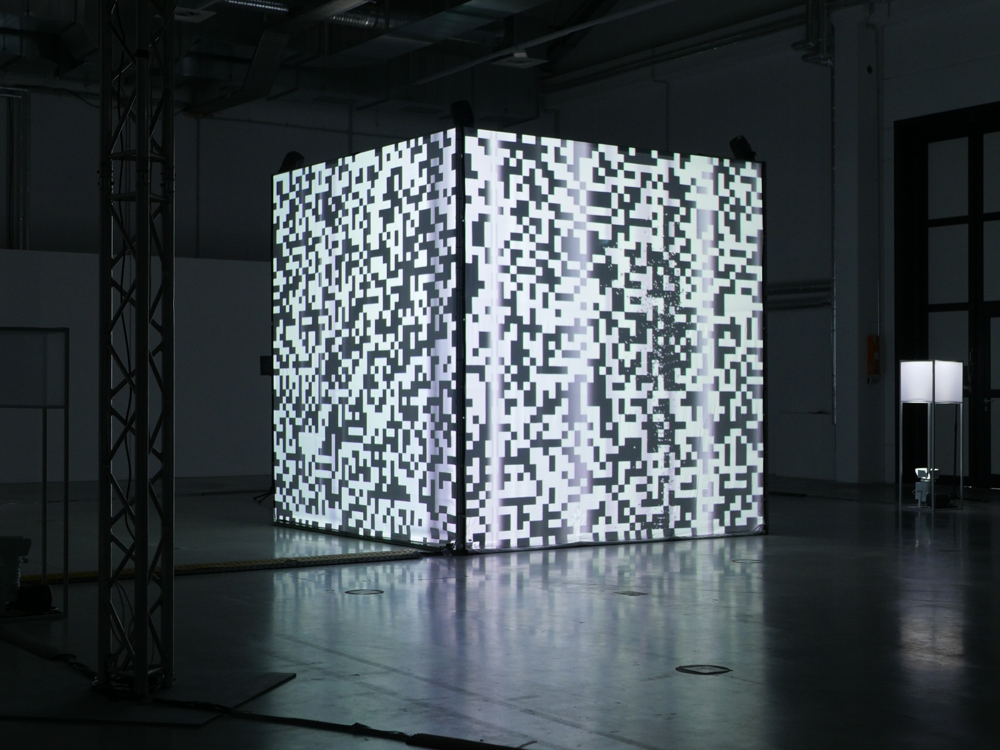
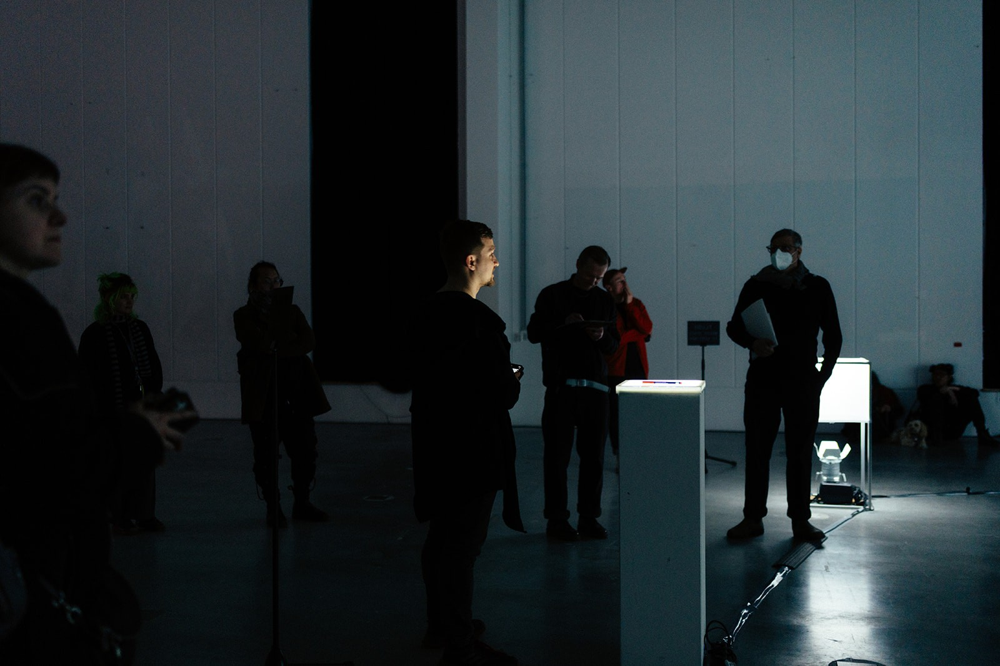

# in the digital shadow: An Embodied Debrief

*in the digital shadow: An Embodied Debrief* is a practice-based research project and installation developed out of the production process of the performance *umbra: In the Digital Shadow*. It rereads that process through accumulated traces and remnants: files, schedules, budgets, chat histories, self-tracking records, notes, physical leftovers, and the residual pressure that remained after the project had formally ended.

The work asks how creative production can be understood once attention shifts away from finished outcomes and toward coordination, delegation, accumulation, and overload. The analytical material extends beyond conventional documentation. It includes project remnants, operational traces, digital residue, and material evidence that stayed attached to the project after its completion.

This documentation accompanies the written master's thesis, which remains the main analytical research document and contains the extended argument, references, methodology, and figure set. The present text documents the installation and the final colloquium presentation, and gives a condensed account of how the thesis research was translated into spatial form.

## Project Overview

The project combines research, data interpretation, and installation design. It proposes *Embodied Debrief* as a method for approaching a completed creative project retrospectively. Debriefing is understood here as a reflective return to a past experience without reducing it to blame or efficiency alone. It becomes embodied because the return happens through lived experience, self-observation, digital and material traces, and the physical form of the installation. Production is reread through residues and reconstructed as a dynamic system of growing traces, uneven resource allocation, distributed agency, and delayed aftereffects.

The reflective base of the project is [*umbra: In the Digital Shadow*](https://www.slavaromanov.art/2025/umbra), an audiovisual performance developed in Bremen in 2025 in collaboration with Chi Him Chik. That production period provides the temporal frame, the collaborative setting, the technical environment, and much of the residual material that is reread here through traces, diagrams, notes, and installation logic. In the sections that follow, `the project` refers to that performance and its afterimage.

The installation translates this logic into a spatial experience. Visitors move through an environment where traces are captured, circulated, intensified, and partially released. The work stages project memory as an unstable, accumulating, and overloaded condition.

## Research Frame

The research is organized through four operational modes of creative production:

- `Collect`
- `Allocate`
- `Delegate`
- `Overload`

These four modes were selected as working analytical lenses for rereading the same project. Together they make it possible to follow accumulation, distribution, externalization, and limit conditions across one shared production process, including its material, technical, organizational, and psychological dimensions.They are grounded in a speculative reading of lived production experience and do not claim to form a closed or exhaustive taxonomy of creative work in general.

### Collect

`Collect` reads the accumulation of project mass across several layers at once: digital files, communication traces, spending, material acquisitions, and shared documentation. One of the central observations is that project growth increases logistical, cognitive, and affective weight alongside possibility. The corresponding figure combines surviving folder chronology, `.toe` files save density, filtered message layers, budget-derived material counts, and observed FigJam revision activity.

### Allocate

`Allocate` reads how time, money, attention, and technical capacity were distributed under scarcity. Schedules, budgets, and event markers show production as a process of continual reassignment.

The allocation in the theis is assembled from a recognized project schedule, a structured budget table, and a recovered project timeline. Red Marks formed a self-reflective layer during production, especially across the densest weeks of work.

### Delegate

`Delegate` studies how work, uncertainty, revision, and responsibility move across humans, AI systems, software, and infrastructure. Here the project focuses on requests, responses, follow-up actions, and the differing roles assigned to human and machine counterparts.

The delegate figures reduce private annotated communication corpora into public-safe comparison tables. Human-directed requests concentrate strongly in coordination and planning, while AI-directed requests are distributed more heavily across analysis, coding, writing, and technical setup.

### Overload

`Overload` reads the point where accumulated pressure exceeds workable capacity and becomes legible through chronology, notes, self-tracking, repeated repair, and recovery cycles. Physiological traces are treated as an embodied overlay aligned to reconstructed project phases.

The overload figures were built by aligning fitness-tracking summaries to a separately recovered project chronology and event frame. The phases were defined through chronology and interpretive framing first; physiological traces were aggregated against that scaffold afterward.

## Installation

The installation translates the analytical logic of the thesis into a visitor-facing environment. It performs the project's internal dynamics spatially.

It is a self-running system that embodies the debrief through its own operational behavior. It gathers physical and digital remnants of the project, reworks elements of its visual and material language, and translates the four production modes into an interactive environment. The visitor enters an already active system that remembers, records, circulates, and modulates traces over time.

Its setup can be read through four connected modules:

- the `Collection Chamber`, which acts as the main capture environment
- a distributed field of `light-sound objects`, which extends memory through the space
- the `Allocate Station`, which assigns traces to slots through red-line interaction
- a `control contour` of networked computers and state logic, which organizes memory, playback, and system transitions

### Collection Chamber

The Collection Chamber is the main capture environment of the installation. It is built around a `3 x 3 x 3 m` projection cube made of aluminium profiles with projection surfaces. Inside it, three depth cameras capture point-cloud traces and send them to the main computer. A resonating metal plate with two piezo microphones forms the sonic capture surface on the floor; this audio layer is routed through an audio interface and mixing console for recording, processing, and direct monitoring.

When a visitor enters the chamber, two processes run in parallel. The system mirrors the visitor's body through live point-cloud capture, while its own memory continues to wander through previously recorded traces. These recalled shadows appear at changing positions: on the cube surfaces, on one or several light-sound objects, or across both zones at once.

Touching the resonating metal plate acts as a recording trigger. It starts a short capture window, approximately fifteen seconds long, in which the visitor's point-cloud image and the corresponding contact or movement sound are recorded as a new shadow. After recording, this shadow enters the system's memory and can be recalled by the Orchestrator. It may reappear on the cube, be assigned to a light-sound object, or return as a synchronized sound-light event.

The chamber therefore serves as both live capture interface and active replay environment.

### Light-Sound Objects

Six light-sound objects extend the chamber into a distributed memory field. Each object consists of aluminium profiles, sewn projection-fabric diffusers, one sound channel, and a DMX LED PAR light. Together they form a six-channel layer across the surrounding space.

These objects distribute both memory fragments and system state. Their sound behaves as part of one connected ten-channel spatial system: four channels inside the cube and six channels across the light-sound objects. The same shared memory-slot logic runs through both zones. Each object can act as an individual memory slot, while the group also behaves as a field across which sound and light patterns move. During more intense states, the objects can carry spatialized noise, pulsing light, or wave-like patterns that make the whole room feel like one distributed display surface.

### Allocate Station

The Allocate Station introduces a second mode of interaction. Paper, marker, and under-camera trigger logic connect gesture to memory allocation inside the system. 

A red line drawn by the visitor activates an allocation event: one recorded shadow is assigned to one available slot, either on a cube surface or in one of the light-sound objects. The selected slot flashes red and begins playback.

Red Marks form an important static and documentary component of the installation. They come from a self-tracking practice used during the production period, where each mark registered a directed block of work and the occupation of time by the project. In the installation, the same gesture becomes ambivalent: it confirms a lived allocation of attention, but it also adds pressure to the system by assigning another shadow to a limited slot.

The station includes an under-camera recognition setup using OpenCV. The camera reads the paper from below, detects newly drawn red lines, separates them from the existing marks, and sends an allocation signal to the main computer. The station also contains an internal `ESP32`-controlled LED layer: in stable states it provides consistent illumination for recognition, while during `flush` it joins the unstable light behavior of the wider installation and stops functioning as an input surface.

### System Logic

Together these components produce a state logic in which waiting, wandering recall, capture, overload, and release remain in tension. The installation stores and replays traces, modulates sound and light by system state, and moves between quieter spatial behavior and more intensified noise-based conditions. It is not only reactive: the system can also assign and recall shadows on its own, so overload can emerge through visitor action, repeated red-line allocation, repeated chamber capture, or the system's own random allocation behavior.

Three internal concepts are central here:

- `shadowDB`, the database of recorded shadows and their metadata
- `slotDB`, the database of limited slots into which those shadows can be distributed
- `Orchestrator`, which governs state transitions, allocation policies, slot timing, and release behavior

These components organize how traces are stored, distributed, recalled, and transformed across system states. A shadow is not only one media file but a linked memory unit: the same identifier can correspond to a recorded point-cloud fragment on the main computer and to a recorded audio fragment on the sound computer. Allocation means that one of these shadows is sent from `shadowDB` into one of the limited slots managed by `slotDB`. The Orchestrator decides when slots are filled, recalled, released, or intensified. This connects the installation back to the analytical model developed in the thesis.

The system works through five principal states:

- `empty`
- `wandering`
- `collection`
- `overload`
- `flush`

`empty` appears after `flush`, when the slots have been cleared and no new assignments are made for a short interval. It is a suspended state: the cube is nearly dark, small pixels remain visible, the sound recalls a tinnitus-like residue, and slow light waves pass through the light-sound objects. From there the system can wake into `wandering`, where it recalls and circulates stored traces without requiring direct input. `collection` begins when a visitor enters the chamber and activates recording. `overload` increases density and pressure across sound, light, and recall behavior. If overload is brief, the system can return to `wandering` or `collection`; if it lasts too long, `flush` begins. During `flush`, the cube shifts into pixelated noise, the light-sound objects flash, distributed noise fills the space, and slots are cleared one after another until the system falls back into `empty`.

### Technical Architecture

The installation runs through three main computational roles:

- a main computer responsible for point-cloud recording, point-cloud display, `shadowDB`, `slotDB`, the `Orchestrator`, and several visual representations of system state
- a controlled sound computer responsible for recording and playback of fragments synchronized with point clouds, and for ten-channel sound distribution
- a controlled Allocate computer responsible for webcam capture and OpenCV-based recognition at the Allocate Station

The controlled computers listen to the main computer and follow the logic defined by the `Orchestrator`. State behavior is therefore defined centrally and distributed across the rest of the system.

The visual layer uses two projectors across the large cube surfaces. The sound system uses one audio input/output interface for recording input and ten-channel output.

## Presentation

The installation was presented in Halle 1 (HfK Bremen) from 31 March to 2 April 2026. The final colloquium took place on 2 April 2026 at 17:00.

The presentation brought together the written research, the installation environment, and the documentary layer. It functioned both as an exhibition situation and as a reflection on project memory. What became visible was the final system together with the density of the process that produced it.

## Reflection

One of the main conclusions of the project is that creative production leaves behind a much larger field of evidence than final outcomes usually suggest. Coordination labor, infrastructural friction, spending, delegation, and recovery all participate in the making of a project, yet often remain outside conventional documentation.

The project proposes a way of rereading those residues without flattening them into a single explanatory system. It treats traces as partial, situated, and uneven. In this sense, the installation and the thesis work together: one builds an environment of encounter, the other reconstructs the analytical frame through which that environment becomes sensible.

The project also leaves open a productive question: how future creative work might be documented in ways that preserve achievements together with accumulation, strain, and distributed agency as constitutive parts of production.

## Repository

The accompanying research repository extends the project toward reproducibility and reuse. It gathers the thesis PDF, reduced public datasets, diagrams, technical notes, and methodological documentation. The repository is intended to make the trace-based approach inspectable and partially reusable as a set of tools and examples for rereading one's own production process through accumulation, allocation, delegation, and overload.

## Access

- Project page: [slavaromanov.art/2026/in-the-digital-shadow](https://www.slavaromanov.art/2026/in-the-digital-shadow)
- Umbra project page: [slavaromanov.art/2025/umbra](https://www.slavaromanov.art/2025/umbra)
- Public research repository: [inthedigitalshadow](https://github.com/davinel000/inthedigitalshadow)
- Thesis PDF: [romanov_in_the_digital_shadow.pdf](https://github.com/davinel000/inthedigitalshadow/blob/main/romanov_in_the_digital_shadow.pdf)
- Video documentation: [slavaromanov_in_the_digital_shadow_teaser.mp4](https://filedn.com/lGT3vQOeVHQFjjI0lPsYmHS/website_slavaromanov_media/small_slavaromanov_in_the_digital_shadow_teaser.mp4)

Additional project, publication, and video links can be attached to this documentation package together with the final media selection.

## Credits

Supervisors:

- Dennis P. Paul
- Ralf Baecker

Photo credits:

- performance and installation photographs by Jimi Liu
- installation photographs by Viacheslav (Slava) Romanov

Acknowledgements:

I would like to thank the *umbra* team and collaborators: Chi Him Chik, Alex Reinig, Leonard Spillner, Juan Luque, and Lucy Savelyeva. My thanks also go to Jimi Liu, Nilya Musaeva, Ali Mukhametov, Markus Walthert, Patrick Peljhan, Alena Romanova, Urbanscreen GmbH & Co KG, Zentrale Ausleihe, and Schwankhalle.

*The project and repository documentation were developed with editorial and analytical assistance from GPT Codex; AI tools were used for selected editing, restructuring, coding, and analysis support; interpretation, curation, selection, and final responsibility remain with the author.*
