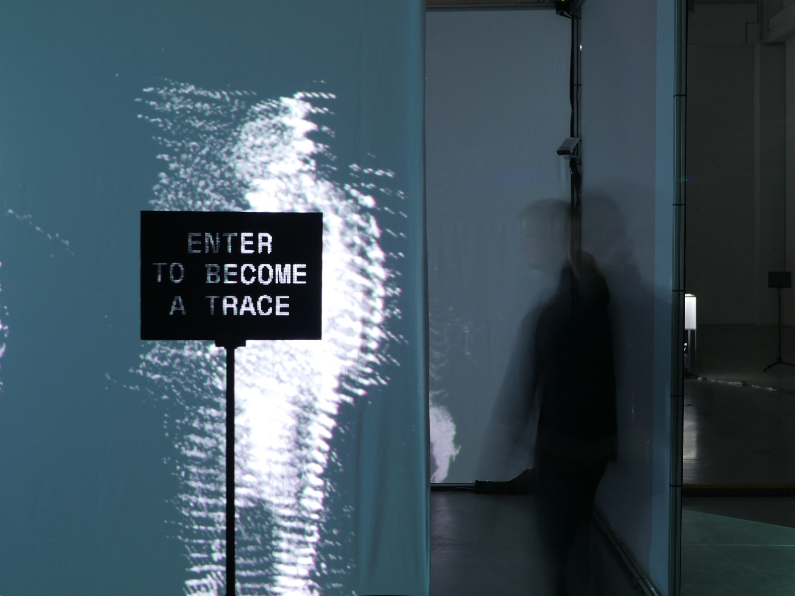
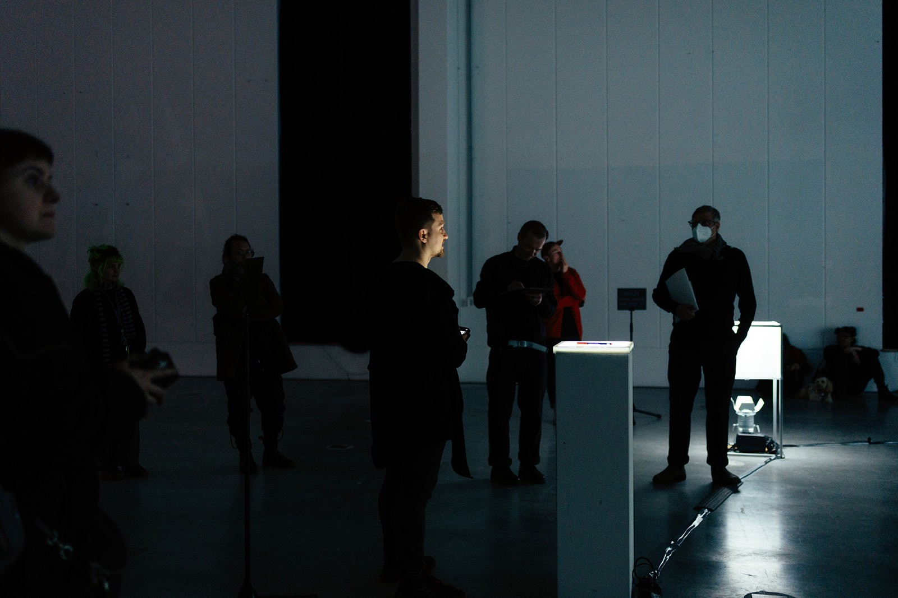

## information

- Title: in the digital shadow: An Embodied Debrief
- Category: Master Thesis
- Student: Viacheslav (Slava) Romanov
- Course Title: Digital Media M.A.
- Supervisors: Dennis P. Paul, Ralf Baecker
- Year: 2026

## text + images + videos

*in the digital shadow: An Embodied Debrief* is an installation and master's thesis project about the hidden traces of creative production: files, schedules, budgets, chats, self-tracking records, delegated work, and overload.

The project grows out of [*umbra: In the Digital Shadow*](https://www.slavaromanov.art/2025/umbra), an audiovisual performance developed in Bremen in 2025 in collaboration with Chi Him Chik. Instead of documenting only the finished performance, *in the digital shadow* returns to the process that produced it and treats its residues as material for reflection.

The installation translates this research into a spatial system. A projection cube, light-sound objects, an Allocate Station, and a networked control logic form an environment that remembers, records, circulates, intensifies, and partially releases traces. Visitors enter an already active memory field: their bodies can be captured as point clouds, their contact with a resonating metal plate can trigger recording, and their red marks can assign stored shadows to limited slots.

The work is structured around four operational modes of creative production: `Collect`, `Allocate`, `Delegate`, and `Overload`. The terms come from the thesis research and become spatial and bodily in the installation. Accumulated traces return as shadows, attention becomes a limited resource, delegation is distributed across humans and machines, and overload appears as density, noise, flashing light, and eventual reset.

Red Marks are both an interaction and a memory of the production process. During the original process, red marks were used as a self-tracking practice for occupied work time. In the installation, drawing a red line activates allocation: one recorded shadow is sent into a slot, the selected position flashes red, and playback begins.

The installation was presented in Halle 1 at HfK Bremen from 31 March to 2 April 2026, ending with a colloquium.

Video documentation: [slavaromanov_in_the_digital_shadow_teaser.mp4](https://filedn.com/lGT3vQOeVHQFjjI0lPsYmHS/website_slavaromanov_media/small_slavaromanov_in_the_digital_shadow_teaser.mp4)

The full written thesis contains the extended research argument, references, methodology, and analytical figure set. The accompanying repository provides the thesis PDF, reduced public datasets, diagrams, technical notes, and documentation for reusing the trace-based approach.

Links:

- Project page: [slavaromanov.art/2026/in-the-digital-shadow](https://www.slavaromanov.art/2026/in-the-digital-shadow)
- Umbra project page: [slavaromanov.art/2025/umbra](https://www.slavaromanov.art/2025/umbra)
- Thesis PDF: [romanov_in_the_digital_shadow.pdf](https://github.com/davinel000/inthedigitalshadow/blob/main/romanov_in_the_digital_shadow.pdf)
- Research repository: [github.com/davinel000/inthedigitalshadow](https://github.com/davinel000/inthedigitalshadow)

Credits:

- Supervisors: Dennis P. Paul, Ralf Baecker
- Photos: Jimi Liu; Viacheslav (Slava) Romanov
