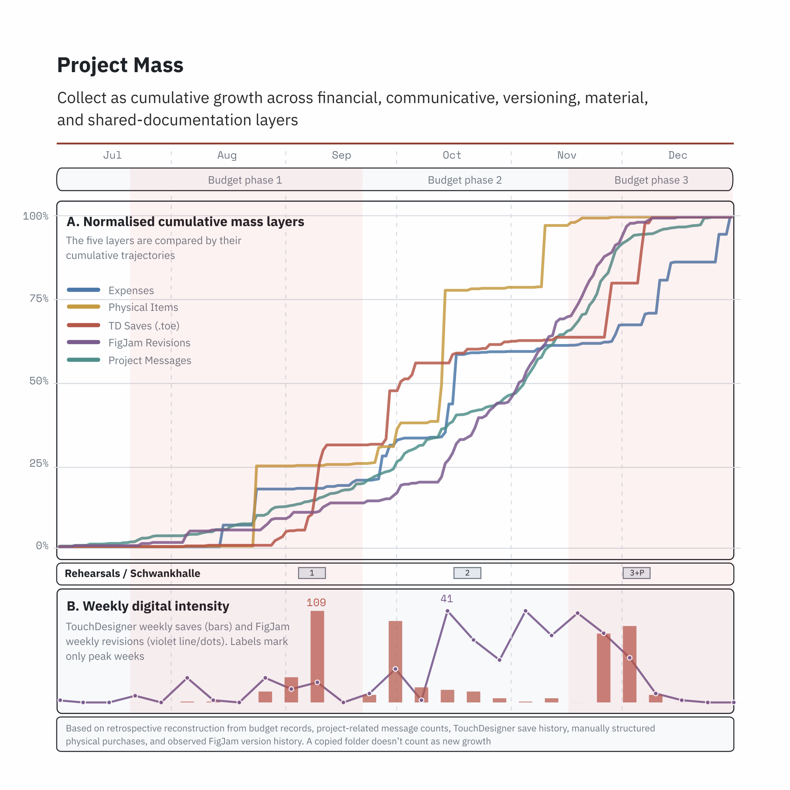
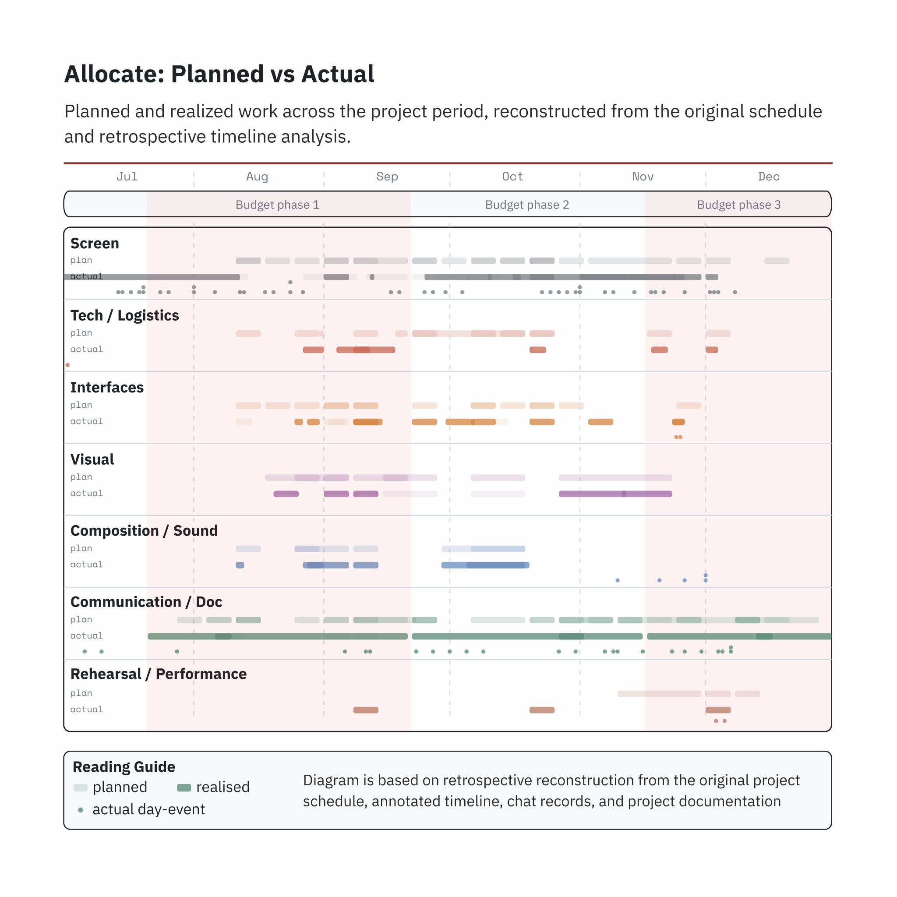
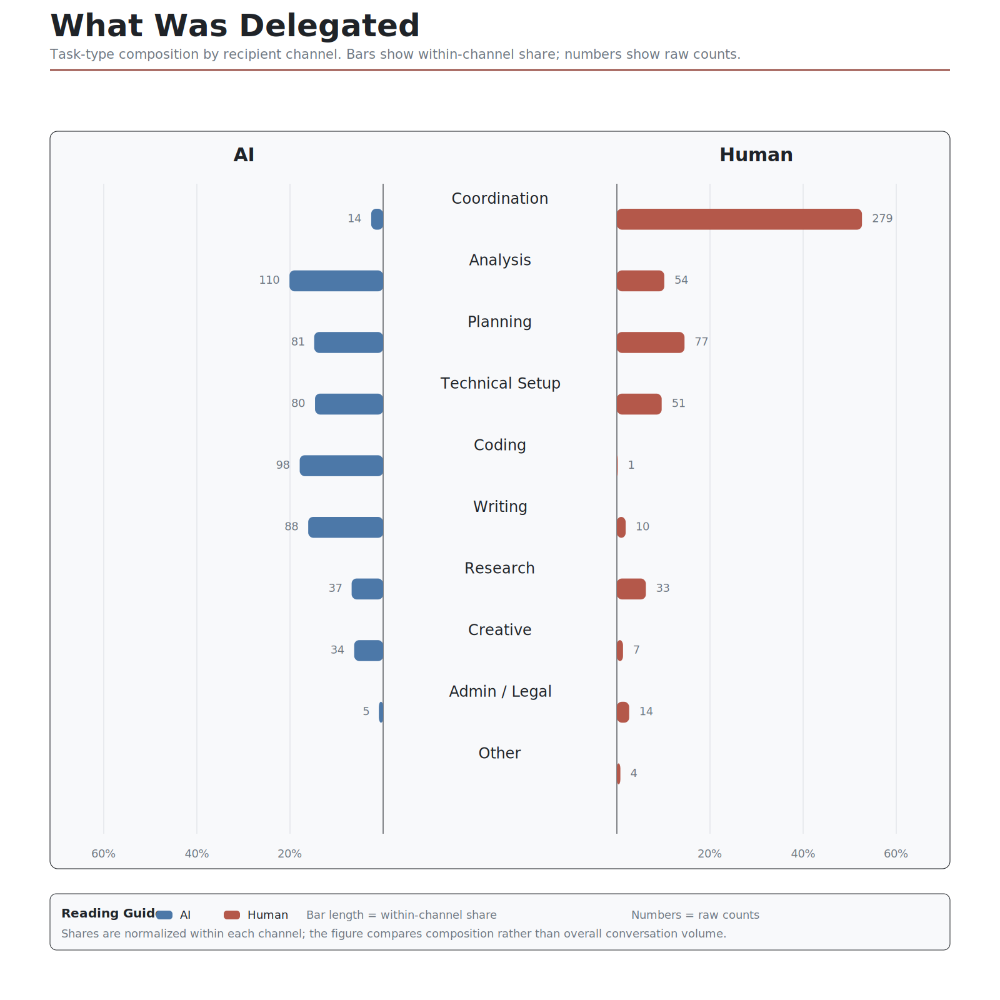
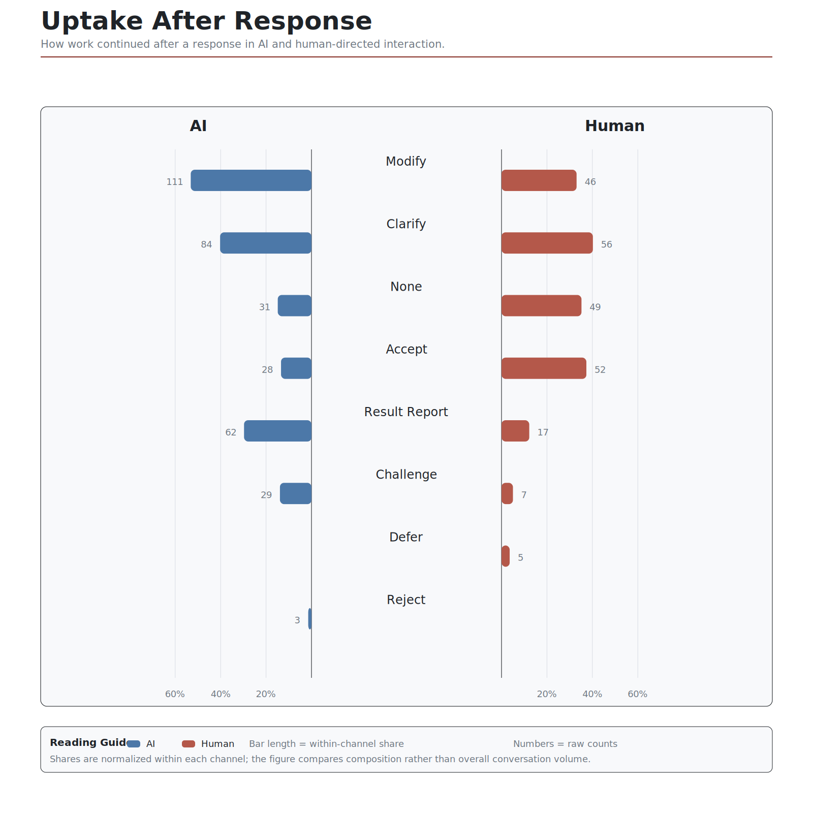
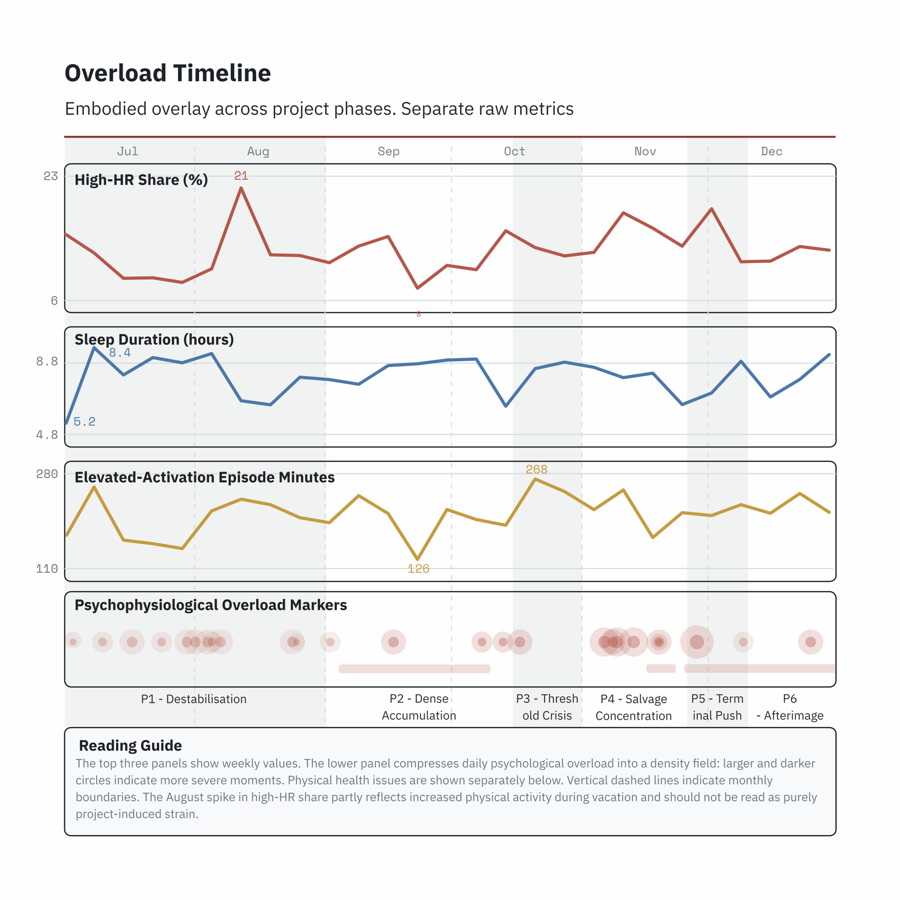
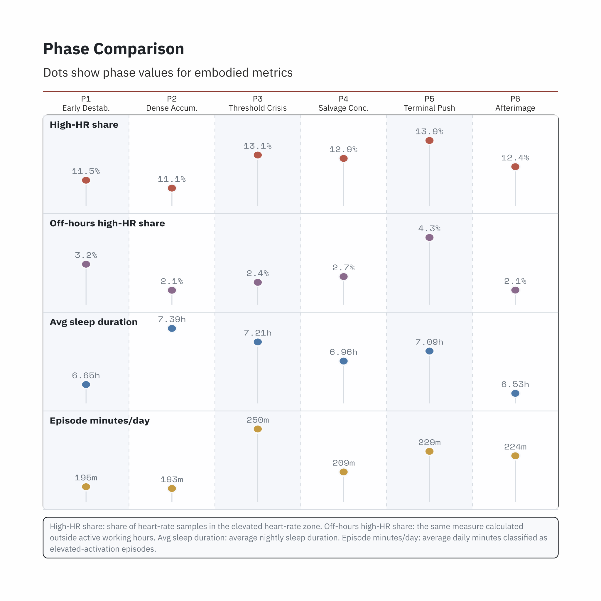

# Key Findings

Short public summary of the main analytical claims developed in **in the digital shadow: An Embodied Debrief**.

## Collect

- Collection is not neutral storage. It increases the logistical, cognitive, and affective weight of the project.
- The project grows across several layers at once: files, notes, purchases, technical states, messages, and bodily traces.
- `project mass` was used to read this accumulation across several registers at once: digital, communicative, financial, material, and shared-documentation layers.
- One of the main shifts of the research is a move away from finished outcome toward process residue: the traces usually left at the edge of documentation become the material of interpretation.

## Allocate

- Allocation makes scarcity visible.
- Time, money, attention, and technical capacity had to be repeatedly distributed across overlapping tasks.
- Schedule views, budget layers, and red-mark tracking showed that allocation was not a secondary administrative layer but part of the project's internal logic.
- The red mark does not register a result. It registers directed effort: a visible claim that a slot of time was actually inhabited by work.

## Delegate

- Delegation does not remove work. It redistributes it.
- Requests to collaborators, software, and AI systems often returned as coordination, prompting, checking, repair, and revision.
- Human and machine delegation increasingly converged in the same interface: the chat.
- This makes distributed agency a normal condition of the project rather than an exception: action is spread across bodies, interfaces, tools, collaborators, and constraints.
- The research also reads delegation as a site of authorship tension: responsibility and control are constantly shifted, shared, and renegotiated.

## Overload

- Overload appears when accumulated traces and expectations exceed available capacity.
- In the project, overload became legible through dense temporal overlaps, repeated recovery cycles, self-tracking pressure, and the growing difficulty of keeping the system coherent.
- The embodied layer is used here as one trace family among others, not as diagnostic proof.
- The installation translates this condition into spatial density, feedback, noise, and partial reset.
- Recovery is not treated as a clean end state. The thesis also points to delayed residue and `afterimage`: the project continues inside the body and its traces after formal completion.

## Reading The Diagrams

The main analytical diagrams in the repository correspond to these questions:

- `project mass`: how the project accumulated across time and media.
  See [project_mass_daily.csv](../data/derived/project_mass/project_mass_daily.csv) and [project_mass_toe_daily.csv](../data/derived/project_mass/project_mass_toe_daily.csv).
- `allocate`: how time and budget were distributed.
  See [allocate_budget_weekly.csv](../data/derived/allocate/allocate_budget_weekly.csv), [allocate_timeline_dataset.csv](../data/derived/allocate/allocate_timeline_dataset.csv), and [allocate.svg](../data/derived/figures/allocate.svg).
- `delegate`: what kinds of work were delegated and to whom.
  See [delegate_task_type_comparison.csv](../data/derived/delegate/delegate_task_type_comparison.csv), [delegate_uptake_comparison.csv](../data/derived/delegate/delegate_uptake_comparison.csv), [delegate_request.svg](../data/derived/figures/delegate_request.svg), and [delegate_uptake.svg](../data/derived/figures/delegate_uptake.svg).
- `overload`: when project density turned into sustained pressure.
  See [overload_phase_summary_fitness.csv](../data/derived/overload/overload_phase_summary_fitness.csv), [overload_timeline_weekly.csv](../data/derived/overload/overload_timeline_weekly.csv), [overload_timeline.svg](../data/derived/figures/overload_timeline.svg), and [overload_phase_comparison.svg](../data/derived/figures/overload_phase_comparison.svg).
