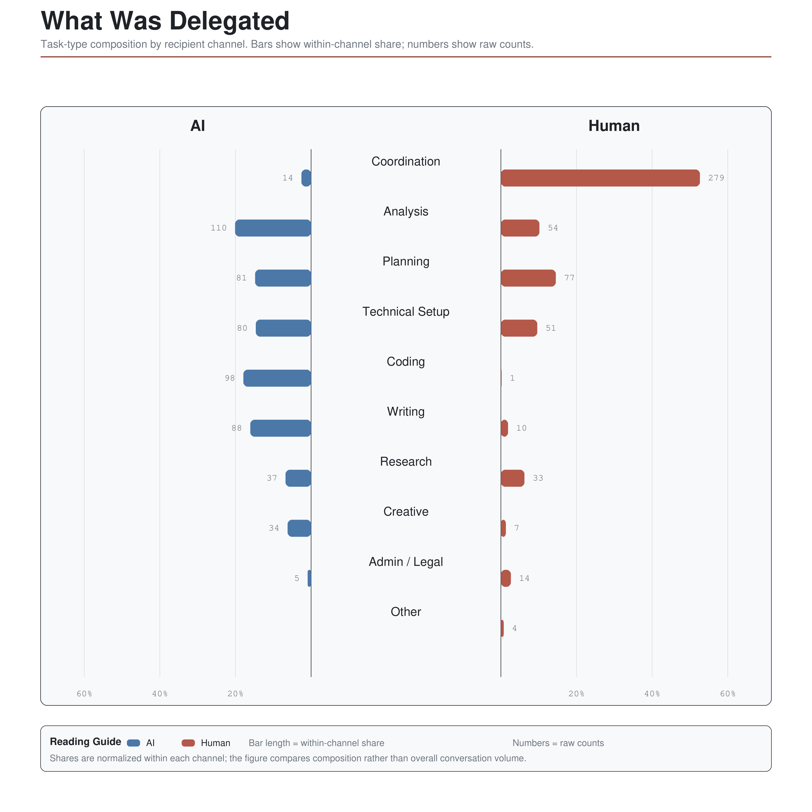
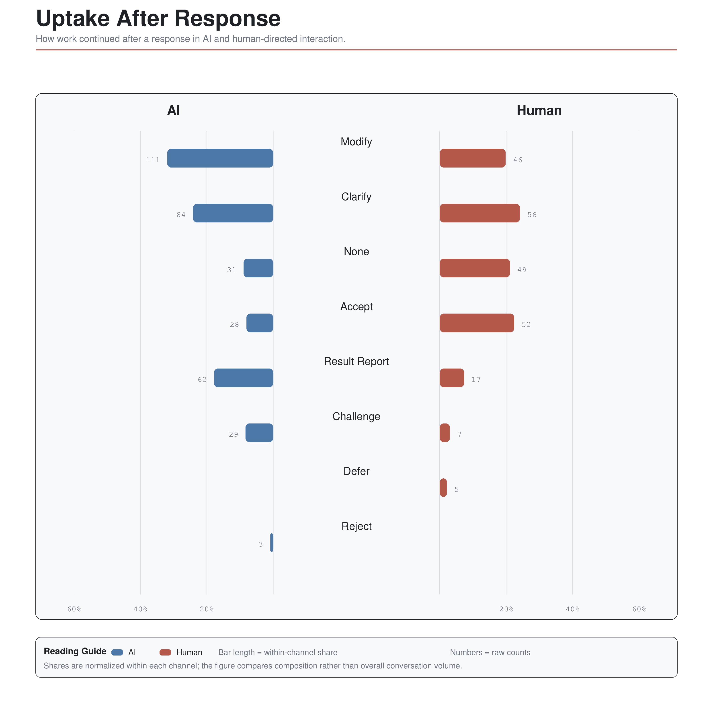

# Key Findings

Short public summary of the main analytical claims developed in **in the digital shadow: An Embodied Debrief**.

## Collect

- Collection increases the logistical, cognitive, and affective weight of the project.
- The project grows across several layers at once: files, notes, purchases, technical states, messages, and bodily traces.
- `project mass` was used to read this accumulation across several registers at once: digital, communicative, financial, material, and shared-documentation layers.
- One of the main shifts of the research is a move away from finished outcome toward process residue: the traces usually left at the edge of documentation become the material of interpretation.

Reading the diagram: `Project Mass` shows accumulated project load across financial, communicative, digital, material, and shared-documentation layers. The upper panel compares normalized cumulative growth; the lower panels return the burst structure of weekly file growth and TouchDesigner save density.

Source logic: this figure combines surviving folder chronology, `.toe` save density, filtered message layers, budget-derived material counts, and observed FigJam revision activity.

Data: [project_mass_daily.csv](../data/derived/project_mass/project_mass_daily.csv) and [project_mass_toe_daily.csv](../data/derived/project_mass/project_mass_toe_daily.csv)

## Allocate

- Allocation makes scarcity visible.
- Time, money, attention, and technical capacity had to be repeatedly distributed across overlapping tasks.
- Schedule views, budget layers, and red-mark tracking showed that allocation belonged to the project's internal logic.
- The red mark registers directed effort: a visible claim that a slot of time was actually inhabited by work.

Reading the diagram: the schedule and budget figure shows how work, materials, and expenses were distributed across the production period. It preserves intended sequencing while keeping visible the pressure of overlapping tasks, deadlines, and occupied time.

Source logic: this figure is assembled from a recognized project schedule, a structured budget table, and a recovered project timeline, with red-mark traces kept as a partial supporting layer rather than a full publication layer.

Data: [allocate_budget_weekly.csv](../data/derived/allocate/allocate_budget_weekly.csv), [allocate_timeline_dataset.csv](../data/derived/allocate/allocate_timeline_dataset.csv), and [allocate_event_markers.csv](../data/derived/allocate/allocate_event_markers.csv)

## Delegate

- Delegation redistributes work.
- Requests to collaborators, software, and AI systems often returned as coordination, prompting, checking, repair, and revision.
- Human and machine delegation increasingly converged in the same interface: the chat.
- This makes distributed agency a basic condition of the project: action is spread across bodies, interfaces, tools, collaborators, and constraints.
- The research also reads delegation as a site of authorship tension: responsibility and control are constantly shifted, shared, and renegotiated.

Reading the diagram: the task-type comparison shows how recipient roles diverged. Human-directed delegation concentrates in coordination and planning, while AI-directed delegation is distributed more strongly across analysis, coding, writing, and technical setup.

Source logic: this figure reduces private annotated communication corpora into request-level aggregates built from codebook-based task typing, manual audit, and targeted model assistance.

Data: [delegate_task_type_comparison.csv](../data/derived/delegate/delegate_task_type_comparison.csv)

Reading the diagram: uptake shows what happened after the response. AI-directed interaction is more revision-heavy through `modify`, `result_report`, and `challenge`, while human-directed interaction more often closes through `accept` or weak continuation coded as `none`. `clarify` remains equally central in both channels.

Source logic: this figure uses the same private communication base, but reads post-response continuation through an explicit uptake coding scheme corrected through manual and model-assisted review.

Data: [delegate_uptake_comparison.csv](../data/derived/delegate/delegate_uptake_comparison.csv)

## Overload

- Overload appears when accumulated traces and expectations exceed available capacity.
- In the project, overload became legible through dense temporal overlaps, repeated recovery cycles, self-tracking pressure, and the growing difficulty of keeping the system coherent.
- The embodied layer enters the analysis as one trace family among others.
- The installation translates this condition into spatial density, feedback, noise, and partial reset.
- Recovery remains uneven. The thesis points to delayed residue and `afterimage`: the project continues inside the body and its traces after formal completion.

Reading the diagram: the timeline overlays project phases with heart-rate activation, sleep, elevated-activation episodes, and marked overload events. It is meant to show when overload becomes chronologically and physiologically legible inside the production process.

Source logic: this figure aligns Mi Fitness-derived summaries to a separately recovered project chronology and overload-event frame.

Data: [overload_timeline_weekly.csv](../data/derived/overload/overload_timeline_weekly.csv)

Reading the diagram: the phase comparison compresses the same material into six phases: Early Destabilization, Dense Accumulation, Threshold Crisis, Salvage Concentration, Terminal Push, and Afterimage. Structural density and physiological strain peak in different phases.

Source logic: phase summaries were aggregated after the chronology and phase scaffold had already been defined; physiology here functions as an aligned embodied overlay rather than the source of phase discovery.

Data: [overload_phase_summary_fitness.csv](../data/derived/overload/overload_phase_summary_fitness.csv) and [overload_phase_comparison.svg](../data/derived/figures/overload_phase_comparison.svg)
